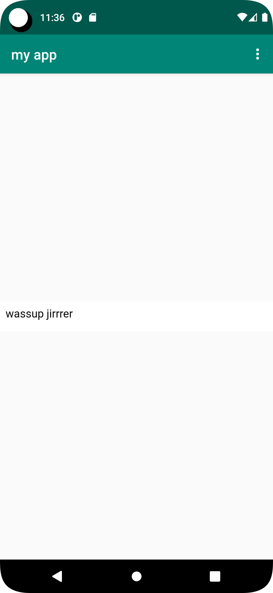

# Rapport

först började jag med att forka filen webview från github, därefter så började jag göra uppgiften från uppgift beskrivningen punktvis. 

den första punkten var att ändra namn på appen. det gjorde jag genom att klicka på values och sen strings. <string name="app_name">my app</string>.

den andra punkten var att ge tillgång till internet och det fick jag svar på genom en av föreläsningarna.  <uses-permission android:name="android.permission.INTERNET"/>.

den tredje punkten var att skapa en webview element i layout activitymain xml genom att ändra textview till webview. <WebView.

den fjärde punkten var att ge webview en id. så jag gav webview id fet. android:id="@+id/fet".

den femte punkten vat att skapa en privat variabel mywebview av typen webview och det görs i main activityjava.    private WebView myWebView;

den 6te punkten var att hitta webview elementet som skapades på steg den första punkten, detta gjordes genom att kalla på id fet som jag gav den.    myWebView = findViewById(R.id.fet);

den 7de punkten säger att skapa en ny webviewclient som läggs till på en webview.  myWebView.setWebViewClient(new WebViewClient());

den 8de punkten var att tillåta java i webviewclienten.  myWebView.getSettings().setJavaScriptEnabled(true);

den 9de punkten var att lägga till en html sida som en asset och det gjorde jag, min heter asset.html.

den 10de punkten var att implimentera en external och internal webpage.
public void showExternalWebPage(){
myWebView.loadUrl("https://his.se");
}

    public void showInternalWebPage(){
        myWebView.loadUrl("file:///android_asset/asset.html");
    }
på internal så har jag min asset.html som url. 
den 11te punkten var att kalla på funktionerna när man klickar på menyn. 

if (id == R.id.action_external_web) {
Log.d("==>","Will display external web page");
showExternalWebPage();
return true;

        }

        if (id == R.id.action_internal_web) {
            Log.d("==>","Will display internal web page");
            showInternalWebPage();
            return true;

        }
## Följande grundsyn gäller dugga-svar: 


```
function errorCallback(error) {
    switch(error.code) {
        case error.PERMISSION_DENIED:
            // Geolocation API stöds inte, gör något
            break;
        case error.POSITION_UNAVAILABLE:
            // Misslyckat positionsanrop, gör något
            break;
        case error.UNKNOWN_ERROR:
            // Okänt fel, gör något
            break;
    }
}
```

Bilder läggs i samma mapp som markdown-filen.




Läs gärna:

- Boulos, M.N.K., Warren, J., Gong, J. & Yue, P. (2010) Web GIS in practice VIII: HTML5 and the canvas element for interactive online mapping. International journal of health geographics 9, 14. Shin, Y. &
- Wunsche, B.C. (2013) A smartphone-based golf simulation exercise game for supporting arthritis patients. 2013 28th International Conference of Image and Vision Computing New Zealand (IVCNZ), IEEE, pp. 459–464.
- Wohlin, C., Runeson, P., Höst, M., Ohlsson, M.C., Regnell, B., Wesslén, A. (2012) Experimentation in Software Engineering, Berlin, Heidelberg: Springer Berlin Heidelberg.
